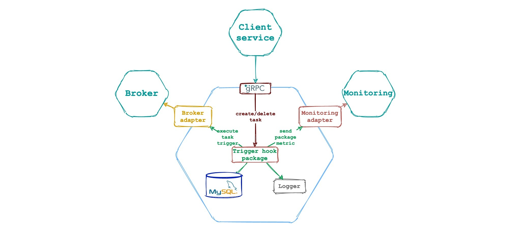

The microservice is part of the application [Message](https://github.com/pvelx/k8s-message-demo).
---
The microservice implements the deferred task execution mechanism.

- Built on the basis of the library [Trigger Hook](https://github.com/pvelx/triggerhook) for its demonstration.
- Uses MySQL as a persistent storage.
- Sends [metrics](https://github.com/pvelx/triggerhook#principle-of-operation) to the InfluxDb.
- The microservice interface uses the GRPC protocol.
- The execution trigger is sent asynchronously via RabbitMQ.



### Build GRPC server
After changing [task.proto](proto/task.proto), you need to run:
```bash
make gen_proto
```
### License

This project is licensed under the MIT License - see the [LICENSE](LICENSE) file for details