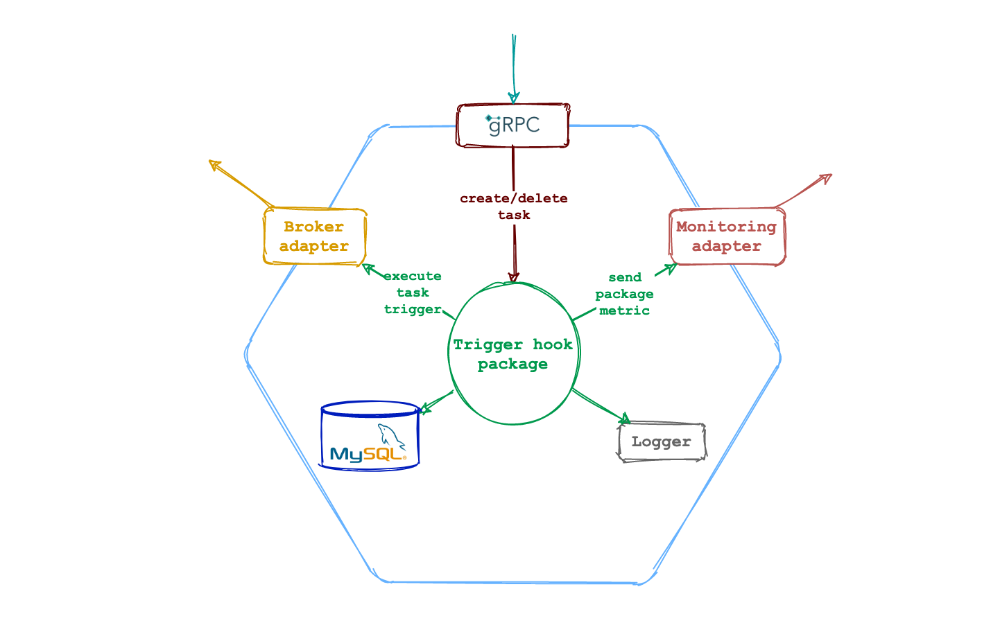

Микросервис является частью приложения [Message](https://github.com/pvelx/k8s-message-demo).
---
Микросервис реализует механизм отложенного выполенения задач. 

- Построен на базе библиотеки [Trigger Hook](https://github.com/pvelx/triggerhook) для ее демонстрации.
- Испольльзует MySql в качестве постоянного хранилища
- Отсылает [метрики](https://github.com/pvelx/triggerhook#%D0%BF%D1%80%D0%B8%D0%BD%D1%86%D0%B8%D0%BF-%D1%80%D0%B0%D0%B1%D0%BE%D1%82%D1%8B)
в InfluxDb.
- Интерфейс микросервиса использует GRPC протокол.
- Триггер на выполнение отправляется асинхронно через RabbitMq




### Build GRPC server
После изменения [task.proto](proto/task.proto) нужно выполнить:
```bash
make gen_proto
```
### License

This project is licensed under the MIT License - see the [LICENSE](LICENSE) file for details